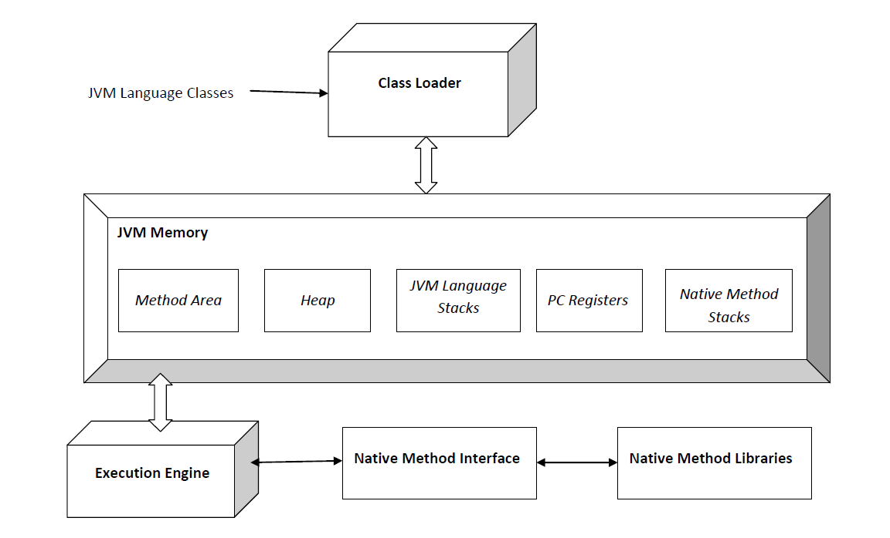
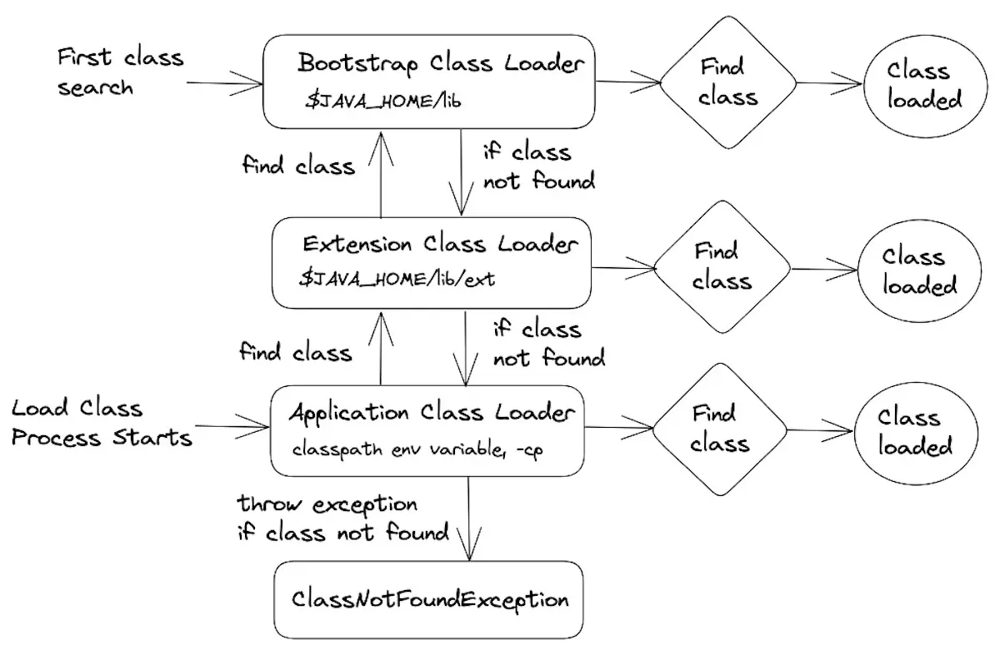

## [JVM]
**Write once, Run anywhere**

- Java 바이트코드를 실행시키기 위한 가상머신

JVM 표준 규격

JVM은 정해진 규격이 있지 정해진 JVM이라는 것은 없다.   
각 회사마다 정해진 규격에 맞는 서로 다른 JVM들이 존재한다고 생각하면 된다.

그리고 JVM에는 대표적인 3개의 메모리 영역이 존재한다.   
1. ClassLoader Subsystem
2. Runtime Data Area
3. Execution Engine

### [ClassLoading Subsystem]

기본적인 클래스 파일을 `load`, `link`, `initialize` 의 세가지 처리과정을 거치고   
Runtime Data Area의 Method Area로 보내는 역할을 한다.   

~~Class Loader에도 여러 종류가 있으나 대표적인부분만 작성했다.~~

- load   

	필요한 클래스 파일들을 중복되지 않게 Load 한다.   
	(이 때 JVM에서는 그저 Class 파일명만 같은게 아닌   
	Class Loader Name + Package Name + Class Name   
	이 모두 일치해야 일치한 Class라고 판단한다)   
	다음과 같은 위계 구조, 계층 구조를 가지고 있다.   

	1. Bootstrap    
		JVM 기동 시에 가장 먼저 생성되며 $JAVA_HOME/.../rt.jar 를 Load 하는 작업을 수행한다.   
		그 후 Object Class 를 포함한 Java API 들을 Load 하게 된다.    
		Bootstrap Class Loader 는 부모를 가지지 않는 가장 상위의 Class Loader 로서    
		다른 Class Loader 와 달리 Java 가 아닌 Native Code 로 구현되어 있다.
	2. Extension    
		Bootstrap Class Loader 를 부모로 하고 기본 Java API 를 제외한    
		$JAVA_HOME/.../ext 에 위치한 확장 Class 들을 Load 하는 작업을 수행한다.   
	3. Application    
		$Classpath 또는 java.class.path 에 위치한 Class 들을 Load 한다.   
   
   
	- 작동원리

		작동 원리는 다음과 같다.   
		Bootstrap 으로 Class 를 먼저 로딩하고   
		찾으면면 종료   
		찾지못하면 다음인 Extension ClassLoader 로 넘어가 Class 를 다시 찾는다.   
		Application ClassLoader 에서도 찾지못하면   
		throw ClassNotFoundException   
		   

	- 규칙

**오류 발생시 ClassNotFoundException 과 NoClassDefFoundError 을 반환한다.**   
ClassNotFoundException 는 처음부터 클래스가 존재하지 않을 때 나오는 오류이고   
NoClassDefFoundError 는 종속된 클래스를 찾지 못했을 때 나오는 오류이다.

- link

	1. Verify   

	2. Prepare   

	3. Resolve   

- initialize

### [Runtime Data Area]

### [Execution Engine]

## 추가 컴포넌트들
Implementation details that are not part of the Java Virtual Machine's specification would unnecessarily constrain the creativity of implementors. For example, the memory layout of run-time data areas, the garbage-collection algorithm used, and any internal optimization of the Java Virtual Machine instructions (for example, translating them into machine code) are left to the discretion of the implementor.    
(~~Java Virtual Machine 사양의 일부가 아닌 구현 세부 사항은 구현자의 창의성을 불필요하게 제한합니다. 예를 들어, 런타임 데이터 영역의 메모리 레이아웃, 사용된 가비지 수집 알고리즘, Java Virtual Machine 명령어의 내부 최적화(예: 기계어 코드로 변환)는 구현자의 재량에 달려 있습니다.~~)

대표적인 종류로는 다음과 같다.

1. Garbage Collector (GC)
2. Just In Time Compiler (JIT Compiler)
3. Native Interface

### [GC]

### [JIT]

### [Native Interface]

#### [출처]
[Oracle Doc](https://docs.oracle.com/javase/specs/jvms/se8/html/jvms-2.html)   
[wiki](https://en.wikipedia.org/wiki/Java_virtual_machine)   
[Data on air](https://dataonair.or.kr/db-tech-reference/d-lounge/technical-data/?mod=document&uid=235933)
[infoworld](https://www.infoworld.com/article/3700054/all-about-java-class-loaders.html)   